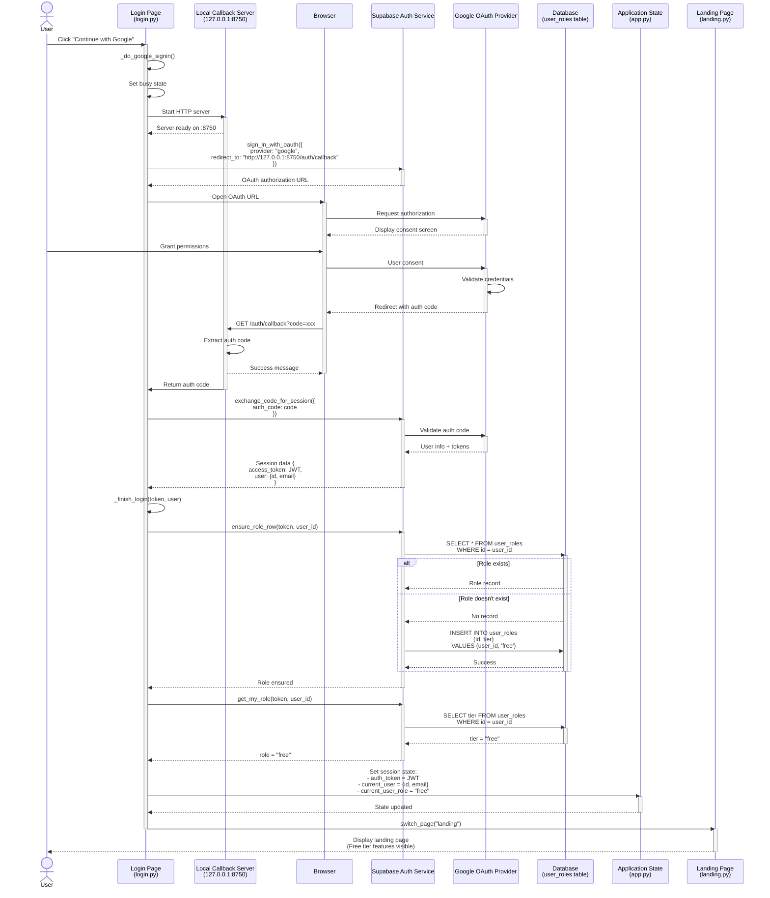

# Sequence Diagram: User Login with Google (Free User)

## User Story
As a free user, I want to login using my Google account so that I can access the blockchain cryptographic analysis tool without creating a separate password.

## Sequence Diagram

## Key Components

### 1. **Login Page (login.py)**
- Provides UI with Google OAuth button
- Manages OAuth flow initiation
- Handles login completion and state management

### 2. **Local Callback Server**
- Runs on `127.0.0.1:8750` during OAuth flow
- Captures authorization code from redirect
- Listens on `/auth/callback` endpoint
- Automatically stops after code capture

### 3. **Supabase Auth Service**
- Generates OAuth authorization URLs
- Exchanges authorization codes for session tokens
- Manages user authentication state
- Provides JWT tokens for API authorization

### 4. **Google OAuth Provider**
- Displays consent screen
- Validates user credentials
- Issues authorization codes
- Provides user identity information

### 5. **Database (user_roles table)**
- Stores user tier information (free/premium/admin)
- Default tier: "free"
- Links to Supabase auth.users via foreign key

### 6. **Application State (app.py)**
- Stores session data in memory:
  - `auth_token`: JWT for API calls
  - `current_user`: User object {id, email}
  - `current_user_role`: Tier level ("free")
- Manages page navigation
- Persists for application lifetime

## Free User Characteristics

After successful login, free users have:

1. **Database Record**:
   - Entry in `user_roles` table with `tier = "free"`
   - Entry in `auth.users` table (managed by Supabase)

2. **Session State**:
   - Valid JWT token (short-lived, typically 1 hour)
   - Role set to "free"
   - Access to basic features

3. **Feature Access**:
   - Limited scan capabilities
   - Basic analysis features
   - Cannot export results (premium feature)
   - No scan history (premium feature)

4. **Upgrade Path**:
   - Can upgrade to premium via payment
   - Admin can manually upgrade tier
   - Upgrade changes `user_roles.tier` to "premium"

## Security Notes

1. **OAuth Flow**: Uses Authorization Code flow (secure for native apps)
2. **Local Callback**: Only accepts requests on localhost
3. **Token Security**: JWT tokens never stored in files or version control
4. **Authorization Code**: Single-use, short-lived code
5. **Row-Level Security**: Supabase RLS policies protect user data
6. **No Client Secrets**: All secrets managed server-side by Supabase

## Error Handling

The flow includes error handling for:
- Timeout waiting for OAuth callback (180 seconds)
- Failed code exchange
- Database connection errors
- Missing role records (auto-created)
- Token validation failures

## Alternative Flows

This diagram shows the desktop application flow. The web application has a similar flow but:
- No local callback server (uses Supabase's built-in redirect handling)
- Session persisted in browser localStorage
- Automatic token refresh enabled
- Same database schema and role system
